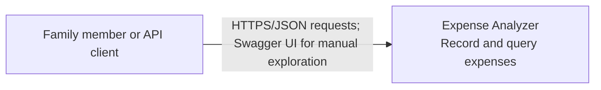
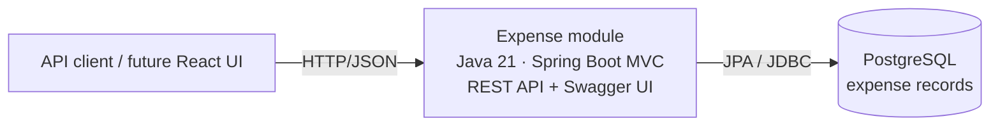

# Architecture

## System purpose and scope

Expense Analyzer stores and retrieves expense records through a versioned REST API. The current application is a single deployable Spring Boot application in the Maven `expense` module. A React client can use the same HTTP API later; no browser application is included now.

Authentication is intentionally absent. Each expense stores `paidBy` as a scalar `long`, with no JPA association or foreign key to a person/authentication module. Clients submit this value directly. The API currently offers no user or family isolation.

## C4: System context

## C4: Container view

The `expense` module contains the REST controllers, request/response DTOs, validation, application service, Spring Data JPA repository, and `Expense` entity. Flyway owns schema changes. Swagger UI is served by the application and loads the checked-in OpenAPI YAML contract.

## Request flow

1. `ExpenseController` binds the HTTP request and validates request fields.
2. `ExpenseService` normalizes user text and currency, builds the query specification, and applies transaction boundaries.
3. `ExpenseRepository` reads or writes `Expense` rows using Spring Data JPA.
4. `ApiExceptionHandler` formats handled validation, not-found, and database conflict errors as `ApiError` responses.

## Persistence and external dependencies

- PostgreSQL is the configured runtime database.
- Flyway migrations are under `expense/src/main/resources/db/migration`.
- H2 is used only for integration tests; it is configured in the `test` profile.
- The OpenAPI specification is `expense/src/main/resources/static/openapi.yaml`; Swagger UI uses it for “Try it out”.

## Current boundaries

- One Maven module and one deployable process.
- One entity: `Expense`.
- No Person/Family entity, authentication, authorization, or ownership enforcement.
- No React or other frontend module.
- No API gateway or external identity provider.
